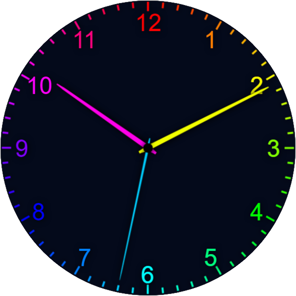

# hue-clock

A nice analog clock, colored hue based, \
powered by [react](https://react.dev/).

## Colors

Colors of hands, numbers and bars are based on hue-color-wheel, so
* 12 is red
* 6 is aqua-marin
* and so on

Am and pm is indicated by pure (pm) or milky (am) colors.

## Development

### Setup
Run `npm install`

### Live dev server:
* Run `npm run serve`
* Open browser at `localhost:3000`
* Now you can see the app, changes will trigger auto-reload.

### Build
Run `npm run build`

## Deployment
1. Run
   * `npm install`
   * `npm run build`
2. Provide files at `/dist` to beeing hosted.

### Demo deployed and hosted by AWS Amplify
For https://hue-clock.johanna-herrmann.de/ [AWS](https://aws.amazon.com/) Amplify is used for deployment and hosting.

The app in AWS Amplify is configured to use this repo's branches as code base. \
Pushes to these branches will trigger build and deployment automatically.
* `dev` branch for https://dev.hue-clock.johanna-herrmann.de/
  (behind a http basic authentication for insiders)
* `main` branch for https://hue-clock.johanna-herrmann.de/

Recommended additional settings:
* Rewrite `/index.html` to `/`
* 404 Redirect all not found to `/`

## Version
1.0.2 (2024-06-22)

## License
This app and it's source code is [MIT Licensed](./LICENSE.md)
